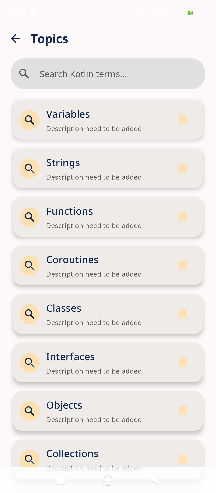
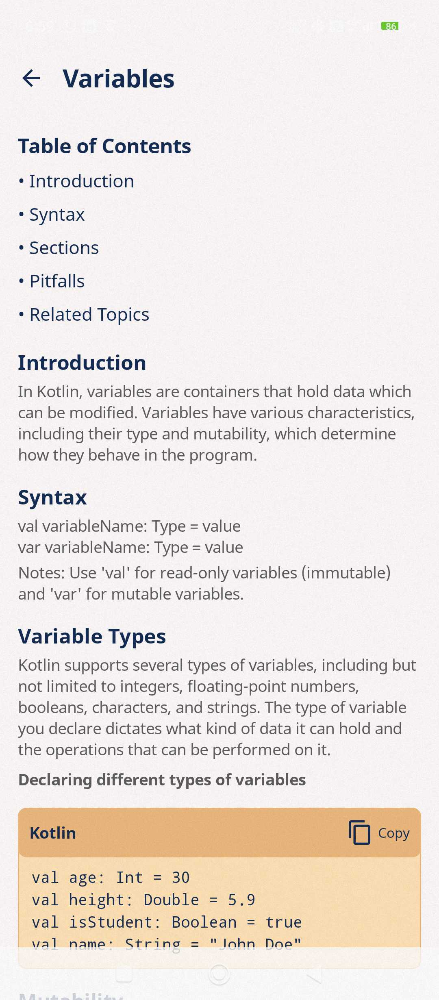

# Kotlin Dictionary 📚

Kotlin Dictionary is a student-led, cross-platform app designed to help learners dive deep into the Kotlin programming language. It serves as an interactive reference where you can explore topics with clear explanations and reinforce your learning through quizzes.

---

## About This Project

This project is part of a collaborative learning effort by students passionate about Kotlin, Jetpack Compose, and cross-platform development. It is being built as we explore and experiment with Kotlin Multiplatform capabilities.

We're exploring core Kotlin concepts and building this app as a way to document our journey, reinforce what we learn, and share it with others along the way.

The Kotlin Dictionary project is being guided by [@RajashekarRaju](https://github.com/RajashekarRaju), who mentors contributors throughout the process. This includes:

- Providing architectural guidance
- Reviewing contributions
- Suggesting improvements
- Promoting best practices in Kotlin development

We're all learning together, and the code evolves as we grow!

---

## 📱 Screenshots

Here are a couple of early previews from the Android version of the app:

  
  

> *More previews coming soon as the UI progresses!*

---

## ⚠️ Disclaimer

This is an educational project developed by students. Expect rapid changes, experiments, and ongoing improvements as part of the learning journey. 😊

---

## 🎢 Roadmap

- [x] Add `ktlint` configuration for code style enforcement.
- [x] Integrate `Arrow Core` for exception handling.
- [x] Add a centralized logger.
- [ ] Create a separate module for reusable UI components.
- [x] Configure GitHub Actions workflow.
- [ ] Assign unique IDs to objects and enforce consistent ordering logic.
- [ ] Correct usage of visibility modifiers across the codebase.
- [ ] Introduce common @Preview annotations for reusable Composable previews.
- [ ] Implement section-wise scroll behavior on the `Detail Screen` for better navigation.
- [ ] Add inline code formatting support for syntax display on the `Detail Screen`.
- [ ] Replace the search icon on the `Topic Card` to improve visual consistency.
- [ ] Implement caching on the `Detail Screen` to store previously viewed topic data.
- [ ] Switch AI integration from OpenAI to Gemini.
- [ ] Refactor network layer for cleaner architecture.