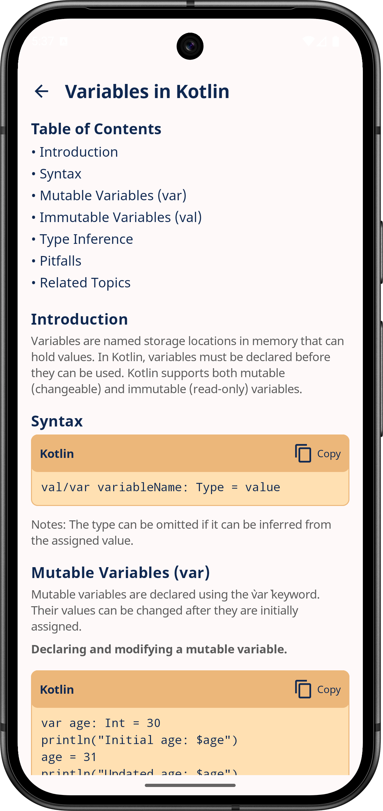

# Kotlin Dictionary 📚


## Download the APK
Access the latest APK for Kotlin Dictionary from the link below.

[](https://github.com/DevelopersBreach/kotlin-dictionary-multiplatform/releases/download/v0.1.0/app-release-v0.1.0.apk)

---

## 🎯 Roadmap

### Roadmap v0.1.0

- [x] Add initial `README` with project overview
- [x] Add `ktlint` configuration for code style enforcement
- [x] Integrate `Arrow Core` for exception handling
- [x] Add `Kermit` logging library and replace println statements
- [x] Configure GitHub Actions workflow
- [x] Implement section-wise scroll behavior on the `Detail Screen` for better navigation
- [x] Replace the search icon on the `Topic Card` to improve visual consistency
- [x] Hide API key from code by using expect/actual for OpenAPI key
- [x] Switch AI integration from OpenAI to Gemini
- [x] Refactor network layer for cleaner architecture
- [x] Create a separate module for reusable UI components

---

### Roadmap v0.2.0

- [ ] Assign unique IDs to objects and enforce consistent ordering logic
- [ ] Correct usage of visibility modifiers across the codebase
- [ ] Introduce common `@Preview` annotations for reusable Composable previews
- [x] Add code block for syntax display on the `Detail Screen`
- [ ] Implement caching on the `Detail Screen` to store previously viewed topic data
- [ ] Implement dynamic topic loading in `TopicRepository` to support scalability
- [ ] Integrate Room database to persist bookmark states
- [ ] Add a `Home Page` for navigation
- [ ] Add a `Quiz Page` to host topic-based quizzes
- [ ] Add a button in `DetailScreen` to attempt a quiz for that topic
- [ ] Add a `Contributors Page` to showcase project contributors
- [ ] Add a `Settings Page` with basic preferences
- [ ] Implement a `Splash Screen`

---

Kotlin Dictionary is a student-led, cross-platform app designed to help learners dive deep into the Kotlin programming language. It serves as an interactive reference where you can explore topics with clear explanations and reinforce your learning through quizzes.   
✨ _The data is powered by AI tools which help automate content generation, ensure consistency, and speed up the documentation._

---

## About This Project

This project is part of a collaborative learning effort by students passionate about Kotlin, Jetpack Compose, and cross-platform development. It is being built as we explore and experiment with Kotlin Multiplatform capabilities.

We're exploring core Kotlin concepts and building this app as a way to document our journey, reinforce what we learn, and share it with others along the way.

The Kotlin Dictionary project is being guided by [@RajashekarRaju](https://github.com/RajashekarRaju), who mentors contributors throughout the process. This includes:

- Providing architectural guidance
- Reviewing contributions
- Suggesting improvements
- Promoting best practices in Kotlin development

We're all learning together, and the code evolves as we grow!

---

## 🎨 Concept Design

Here’s an early concept image illustrating the app’s design:


---

## 📱 Screenshots

Here are a couple of early previews from the Android version of the app:

| Topic | Detail |
| :---: | :----: |
|  |  |

> *More previews coming soon as the UI progresses!*

---

## ⚠️ Disclaimer

This is an educational project developed by students. Expect rapid changes, experiments, and ongoing improvements as part of the learning journey. 😊

---

## License

```
Copyright 2025 Developers Breach

Licensed under the Apache License, Version 2.0 (the "License");
you may not use this file except in compliance with the License.
You may obtain a copy of the License at

    https://www.apache.org/licenses/LICENSE-2.0

Unless required by applicable law or agreed to in writing, software
distributed under the License is distributed on an "AS IS" BASIS,
WITHOUT WARRANTIES OR CONDITIONS OF ANY KIND, either express or implied.
See the License for the specific language governing permissions and
limitations under the License.
```
